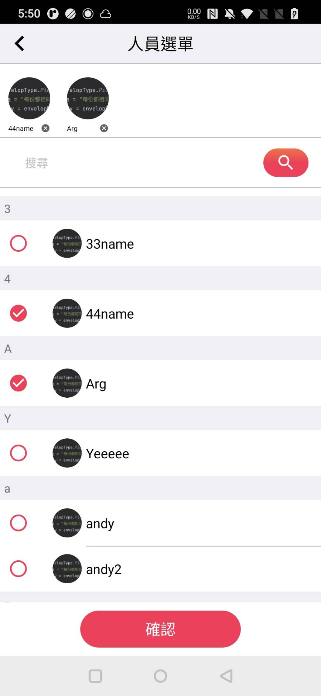

# RedEnvelope

紅包功能模組 RedEnvelope （僅提供操作圖片及markdown 使用說明） 
項目包含資訊設置、可移動浮動提示、紅包開啟展示，開放許多可自定義UI設置並完成基礎防呆設置 

## 展示及說明

<table>
    <tr>
        <th>紅包設定 <a href="./RedEnvelopSetting.md">RedEnvelopSetting</a></th>
        <th>人員列表 <a href="./RedEnvelopSetting.md">RedEnvelopPersionList</a></th>
    </tr>
    <tr>
        <td></td>
        <td></td>
    </tr>
    <tr>
        <th>紅包浮動球 <a href="./RedEnvelopFab.md">RedEnvelopFab</a></th>
        <th>領取紅包提示效果 <a href="./RedEnvelopNotice.md">RedEnvelopNotice</a></th>
    </tr>
    <tr>
        <td></td>
        <td></td>
    </tr>
</table>

## Version History

> ### v1.2.2(2022/11/22)
> - EnvelopeSetting、SelectUsers 調整預設介面
> - EnvelopeSetting、SelectUsers 增設錯誤提示判斷
> - EnvelopeSetting、SelectUsers 調整及增加可設定參數 
    > [Modify] setPersion、setAccBalance 
    > [Add] setUsersCheckBtnT、setErrMsg、setErrMsgMap
> - SelectUsers 修正未紀錄前次選擇選項

> ### v1.2.1(2022/11/21)
> - fixBug 提示球顯示隱藏設置

> ### v1.2.0(2022/11/18)
> - EnvelopeFab 紅包提示浮動球

> ### v1.1.0(2022/11/16)
> - EnvelopNotice 開啟紅包展示效果

> ### v1.0.0(2022/11/15)
> - new project.
> - EnvelopeSetting 紅包設置
> - SelectUsers 人員列表設置
