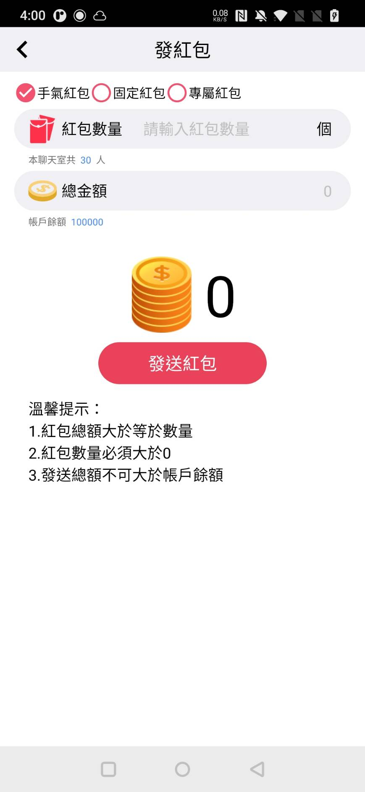
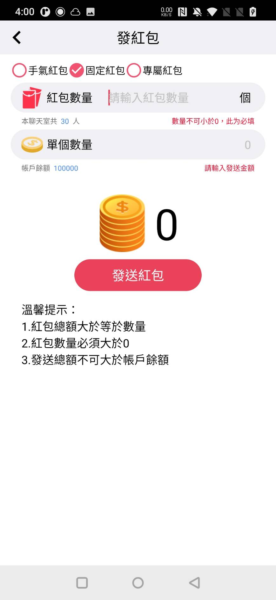
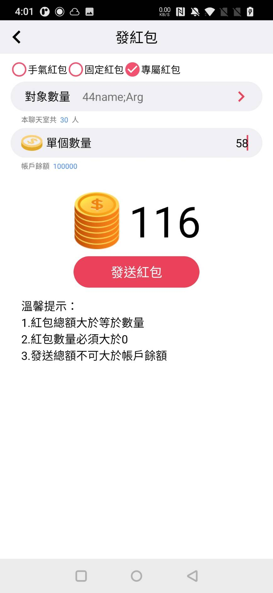
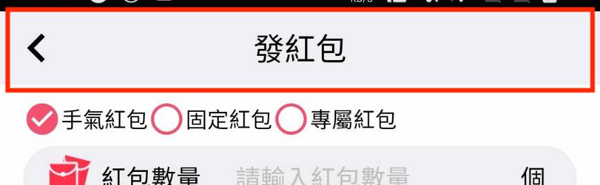
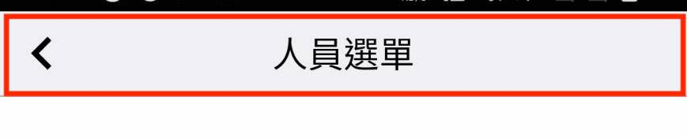
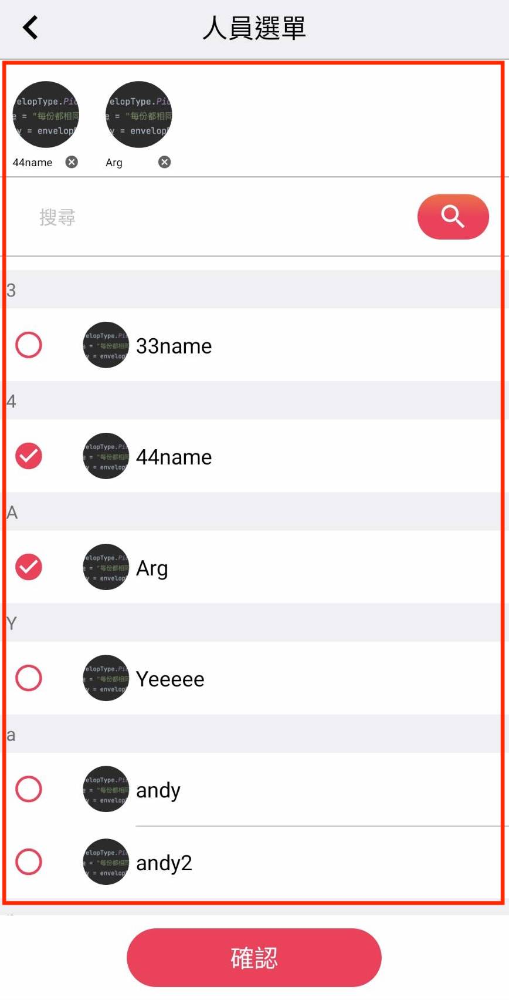

# RedEnvelope-RedEnvelopSetting、RedEnvelopPersionList

紅包設定頁面 RedEnvelopSetting、人員選擇列表 RedEnvelopPersionList <br>
紅包設定內容可個別設置顯示圖示與內容字 <br>


 <br>


## Usage 使用方式

```
//          方法1
            EnvelopeSetting.Builder setting = new EnvelopeSetting.Builder(this);
            setting.setTitle("發紅包2");
            setting.setPrompt("溫馨提示：\n還是用builder吧");
            setting.show();

//          方法2
            EnvelopeSetting setting = new EnvelopeSetting.Builder(this)
                .setTitle("發紅包")
                .setTypes(new ArrayList<>(Arrays.asList(
                        new EnvelopTypeData(EnvelopType.TotalForRandom),
                        new EnvelopTypeData(EnvelopType.PicesOfSame),
                        new EnvelopTypeData(EnvelopType.GiveForSpecify))))
                .setPersion("30")
                .setUsersTitle("人員選單")
                .setUsers(new ArrayList<>(Arrays.asList(
                        new UserData("name1", 1l, ""),
                        new UserData("米粒", 33l, ""),
                        new UserData("安安", 28l, ""))
                .setOnTitleLeftListener(dialog -> dialog.dismiss())
                .setOnSettingListener((dialog, envelopData) -> {
                    dialog.dismiss();
                    setList(true, envelopData);
                })
                .show();
```

## parameter 可用參數

<table>
    <tr>
        <th width="20%">項目位置</th>
        <th width="20%">參數名稱</th>
        <th width="35%">設置使用型態</th>
        <th width="25%">說明</th>
    </tr>
    <tr>
        <td rowspan="5">標頭區塊<br>
            <br>
            <br>
        </td>
        <td>紅包設置的標頭</td>
        <td>setTitle(CharSequence mTitle)</td>
        <td>未設置的話會當作不需要就不顯示</td>
    </tr>
    <tr>
        <!-- <td>標頭區塊</td> 合併欄位 -->
        <td>人員設置的標頭</td>
        <td>setUsersTitle(CharSequence usersTitle)</td>
        <td>未設置的話會當作不需要就不顯示</td>
    </tr>
    <tr>
        <!-- <td>標頭區塊</td> 合併欄位 -->
        <td>標頭返回鍵監聽</td>
        <td>setOnTitleLeftListener(TitleBtnListener onClick)</td>
        <td>
            如果未設置標頭，則完全不會顯示；
            如果設置標頭，但未設置返回鍵監聽，則僅顯示標頭不顯示返回鍵。
        </td>
    </tr>
    <tr>
        <!-- <td>標頭區塊</td> 合併欄位 -->
        <td>標頭背景色</td>
        <td>setTitleBgColor(int color)</td>
        <td rowspan="2">
            同步影響標頭區塊
            <ul>
                <li>紅包設置</li>
                <li>人員列表標頭</li>
            </ul>
        </td>
    </tr>
    <tr>
        <!-- <td>標頭區塊</td> 合併欄位 -->
        <td>標頭文字色</td>
        <td>setTitleTextColor(int color)</td>
        <!-- <td>同步影響標頭區塊</td> 合併欄位 -->
    </tr>
    <tr>
        <td rowspan="10">紅包種類區塊<br>
            
        </td>
        <td rowspan="2">紅包種類列表</td>
        <td>setTypes(List<EnvelopTypeData> types)</td>
        <td>
            <code>*必填</code><br>
            <font color="#FF0025">列表設置最少必須設置一項紅包種類</font><br>
        </td>
    </tr>
    <tr>
        <!-- <td>紅包種類及輸入區塊</td> 合併欄位 -->
        <!-- <td>紅包種類列表</td> 合併欄位 -->
        <td>
            <b>EnvelopTypeData 說明</b><br>
            <ul>
                <li>EnvelopType：<br>
                <table><td>
                    int TotalForRandom = 0; // 總額隨機分配<br>
                    int PicesOfSame = 1;    //每份都相同<br>
                    int GiveForSpecify = 2; //指定給予<br>
                </td></table></li>
                <li>可僅設置種類項<br>
                <table><td>
                    EnvelopTypeData(Integer envelopType)
                </td></table></li>
                <li>可直接設置顯示內容
                <table><td>
                    EnvelopTypeData(Integer envelopType, String typeName, <br>
                        Drawable countIcon, String countTitleName, <br>
                        String countHintText, String countEndText, <br>
                        Drawable moneyIcon, String moneyTitleName, <br>
                        String moneyHintText, String moneyEndText) <br>
                </td></table></li>
                <li>可使用Res設置
                <table><td>
                    EnvelopTypeData(Integer envelopType, @StringRes Integer typeNameId, <br>
                       @DrawableRes Integer countIconId, @StringRes Integer countTitleNameId,<br>
                       @StringRes Integer countHintTextId, @StringRes Integer countEndTextId,<br>
                       @DrawableRes Integer moneyIconId, @StringRes Integer moneyTitleNameId, <br>
                       @StringRes Integer moneyHintTextId, @StringRes Integer moneyEndTextId) <br>
                </td></table></li>
                <li>可宣告後個別設置
                <table><td>
                    EnvelopTypeData typeData = new EnvelopTypeData(EnvelopType.GiveForSpecify);<br>
                    typeData.setMoneyTitleName("金額");<br>
                    typeData.setMoneyHintText("輸入紅包額");<br>
                    typeData.setMoneyIconId(R.drawable.coins);<br>
                </td></table></li>
            </ul>
        </td>
        <td>
            紅包可設置內容：<br>
            <ul>
                <li>envelopType：種類標示<code>*必填</code></li>
                <li>typeName：種類顯示名稱</li>
                <li>countIcon：數量圖示</li>
                <li>countTitleName：數量名稱</li>
                <li>countHintText：數量輸入欄提示字</li>
                <li>countEndText：數量結尾<br>（未設置會隱藏站位）</li>
                <li>moneyIcon：金額圖示</li>
                <li>moneyTitleName：金額名稱</li>
                <li>moneyHintText：金額輸入欄提示字</li>
                <li>moneyEndText：金額結尾<br>（未設置會隱藏站位）</li>
            </ul>
        </td>
    </tr>
    <tr>
        <!-- <td>紅包種類及輸入區塊</td> 合併欄位 -->
        <td rowspan="2">錯誤訊息提示字設置</td>
        <td>setErrMsg(Integer errorType, String errText)</td>
        <td rowspan="2">
            只會用到對應errorType，多設是沒用的！<br>
            errorType會取最後設置的內容為主<br>
            <b>SettingError 說明</b><br>
            <ul>
                <li>noCount：數量不可小於0</li>
                <li>noPersion：請選擇發送人</li>
                <li>noMoney：請輸入發送金額</li>
                <li>countMax：超過可發送數量最大值</li>
                <li>countMin：少於可發送數量最小值</li>
                <li>totalOverBalance：發送金額超過錢包餘額，余额不足</li>
                <li>countOverTotal：总金额需大于或等于红包数量</li>
                <li>countOverPersion：发送数量不能超过聊天室人数</li>
            </ul>
        </td>
    </tr>
    <tr>
        <!-- <td>紅包種類及輸入區塊</td> 合併欄位 -->
        <!-- <td>合併欄位</td> -->
        <td>setErrMsgMap(Map<Integer, String> err)</td>
        <!-- <td>合併欄位</td> -->
    </tr>
    <tr>
        <!-- <td>紅包種類及輸入區塊</td> 合併欄位 -->
        <td>數量Icon是否顯示</td>
        <td>setCountIconShow(Boolean isShow)</td>
        <td>預設為顯示<br>如果後續紅包種類未設置圖片也會自動隱藏圖示佔位</td>
    </tr>
    <tr>
        <!-- <td>紅包種類及輸入區塊</td> 合併欄位 -->
        <td>金額Icon是否顯示</td>
        <td>setMoneyIconShow(Boolean isShow)</td>
        <td>預設為顯示<br>如果後續紅包種類未設置圖片也會自動隱藏圖示佔位</td>
    </tr>
    <tr>
        <!-- <td>紅包種類及輸入區塊</td> 合併欄位 -->
        <td>紅包數量最大值</td>
        <td>setMaxCount(Integer max)</td>
        <td>預設不限制</td>
    </tr>
    <tr>
        <!-- <td>紅包種類及輸入區塊</td> 合併欄位 -->
        <td>紅包數量最小值</td>
        <td>setMinCount(Integer min)</td>
        <td>預設不限制</td>
    </tr>
    <tr>
        <!-- <td>紅包種類及輸入區塊</td> 合併欄位 -->
        <td>紅包種類選項色彩</td>
        <td>setTypeRadioColor(ColorStateList colorList)</td>
        <td></td>
    </tr>
    <tr>
        <!-- <td>紅包種類及輸入區塊</td> 合併欄位 -->
        <td>紅包種類輸入錯誤提示字顯示色</td>
        <td>setErrMsgTextColor(int color)</td>
        <td></td>
    </tr>
    <tr>
        <td rowspan="8">備註區塊<br>
            
        </td>
        <td>聊天室人數</td>
        <td>setPersion(Integer mPersion)</td>
        <td>
            <code">*必填</code><br>
            [PersionT1][Persion][PersionT2]<br>
            ex: [本聊天室共][30][人]
        </td>
    </tr>
    <tr>
        <!-- <td>備註區塊</td> 合併欄位 -->
        <td>用戶錢包餘額</td>
        <td>setAccBalance(BigDecimal mAccBalance)</td>
        <td>
            <code>*必填</code><br>
            [AccBalanceT1][AccBalance][AccBalanceT2]<br>
            ex: [帳戶餘額][10000][元]
        </td>
    </tr>
    <tr>
        <!-- <td>備註區塊</td> 合併欄位 -->
        <td>聊天室人數前綴</td>
        <td>setPersionT1(CharSequence mPersionT1)</td>
        <td>
            [PersionT1][Persion][PersionT2]<br>
            ex: [本聊天室共][30][人]
        </td>
    </tr>
    <tr>
        <!-- <td>備註區塊</td> 合併欄位 -->
        <td>聊天室人數後綴</td>
        <td>setPersionT2(CharSequence mPersionT2)</td>
        <td>
            [PersionT1][Persion][PersionT2]<br>
            ex: [本聊天室共][30][人]
        </td>
    </tr>
    <tr>
        <!-- <td>備註區塊</td> 合併欄位 -->
        <td>用戶錢包餘額前綴</td>
        <td>setAccBalanceT1(CharSequence mAccBalanceT1)</td>
        <td>
            [AccBalanceT1][AccBalance][AccBalanceT2]<br>
            ex: [帳戶餘額][10000][元]
        </td>
    </tr>
    <tr>
        <!-- <td>備註區塊</td> 合併欄位 -->
        <td>用戶錢包餘額前綴</td>
        <td>setAccBalanceT2(CharSequence mAccBalanceT2)</td>
        <td>
            [AccBalanceT1][AccBalance][AccBalanceT2]<br>
            ex: [帳戶餘額][10000][元]
        </td>
    </tr>
    <tr>
        <!-- <td>備註區塊</td> 合併欄位 -->
        <td>提示字體色</td>
        <td>setRemarkTextColor(int color)</td>
        <td>提示前後綴色彩</td>
    </tr>
    <tr>
        <!-- <td>備註區塊</td> 合併欄位 -->
        <td>提示字體高亮色</td>
        <td>setRemarkHightTextColor(int color)</td>
        <td>提示色</td>
    </tr>
    <tr>
        <td rowspan="3">總花費計算區塊<br>
            
        </td>
        <td>更換總花費Icon</td>
        <td>setTotalIcon(Drawable mTotalIcon)</td>
        <td>設置null則不顯示</td>
    </tr>
    <tr>
        <!-- <td>總花費計算區塊</td> 合併欄位 -->
        <td>總花費金額Icon是否顯示</td>
        <td>setTotalIconShow(Boolean isShow)</td>
        <td>預設為顯示<br>如果後續未設置圖片也會自動隱藏圖示佔位</td>
    </tr>
    <tr>
        <!-- <td>總花費計算區塊</td> 合併欄位 -->
        <td>總花費金額字體色</td>
        <td>setTotalTextColor(int color)</td>
        <td></td>
    </tr>
    <tr>
        <td rowspan="4">送出設置區塊<br>
            
        </td>
        <td>發送按鈕顯示字</td>
        <td>setSendT(CharSequence mSendT)</td>
        <td></td>
    </tr>
    <tr>
        <!-- <td>送出設置區塊</td> 合併欄位 -->
        <td>設定完成按鈕監聽</td>
        <td>setOnSettingListener(EnvelopSettingListener mSettingListener)</td>
        <td></td>
    </tr>
    <tr>
        <!-- <td>送出設置區塊</td> 合併欄位 -->
        <td>設定完成按鈕圖</td>
        <td>setBtnDrawableRes(Integer btnDRes)</td>
        <td>
            同步影響標頭區塊
            <ul>
                <li>紅包設置-發送按鈕</li>
                <li>人員列表搜-尋按鈕</li>
                <li>人員列表-確認按鈕</li>
            </ul>
        </td>
    </tr>
    <tr>
        <!-- <td>送出設置區塊</td> 合併欄位 -->
        <td>設定完成按鈕字體色</td>
        <td>setBtnTextColor(int color)</td>
        <td></td>
    </tr>
    <tr>
        <td rowspan="2">提示說明區塊<br>
            
        </td>
        <td>提示說明顯示字</td>
        <td>setPrompt(CharSequence mPrompt)</td>
        <td></td>
    </tr>
    <tr>
        <!-- <td>提示說明區塊</td> 合併欄位 -->
        <td>提示說明字體色</td>
        <td>setPromptTextColor(int color)</td>
        <td></td>
    </tr>
    <tr>
        <td rowspan="4">人員選單列表區塊<br>
            
        </td>
        <td rowspan="2">人員選單列表</td>
        <td>setUsers(List<UserData> users)</td>
        <td>
            如果未設置 EnvelopType.GiveForSpecify，則可以不設置；
            如果設置 EnvelopType.GiveForSpecify，而未設人員列表，則選單會無人可選。
        </td>
    </tr>
        <!-- <td>人員選單列表區塊</td> 合併欄位 -->
        <!-- <td>人員選單列表</td> 合併欄位 -->
        <td>
            <b>UserData 說明</b><br>
            <ul>
                <li>可直接設置顯示內容<br>
                <table><td>
                    UserData(String userName, Long userId, String userIconUrl)
                </td></table></li>
            </ul>
        </td>
        <td>
            可設置內容：<br>
            <ul>
                <li>userName：用戶顯示名稱</li>
                <li>userId：用戶代號</li>
                <li>userIconUrl：用戶頭像Url</li>
            </ul>
        </td>
    </tr>
    <tr>
        <!-- <td>人員選單列表區塊</td> 合併欄位 -->
        <td>人員設置的確認按鈕顯示字</td>
        <td>setUsersCheckBtnT(CharSequence usersCheckBtnT) </td>
        <td></td>
    </tr>
    <tr>
        <!-- <td>人員選單列表區塊</td> 合併欄位 -->
        <td>人員設置的用戶頭像圓角設置</td>
        <td>setUsersIconRadius(int radius)</td>
        <td>設置角度 1 以上才會有效果</td>
    </tr>
    <tr>
        <td rowspan="3">其他設定</td>
        <td>可否空白處關閉</td>
        <td>setCancelable(Boolean)</td>
        <td></td>
    </tr>
    <tr>
        <!-- <td>其他設定</td> 合併欄位 -->
        <td>關閉監聽</td>
        <td>setOnDismissListener(DialogInterface.OnDismissListener)</td>
        <td></td>
    </tr>
    <tr>
        <!-- <td>其他設定</td> 合併欄位 -->
        <td>頁面背景色</td>
        <td>setBgColor(int color)</td>
        <td>
            同步影響區塊
            <ul>
                <li>紅包設置</li>
                <li>人員列表標頭</li>
            </ul>
        </td>
    </tr>
</table>
